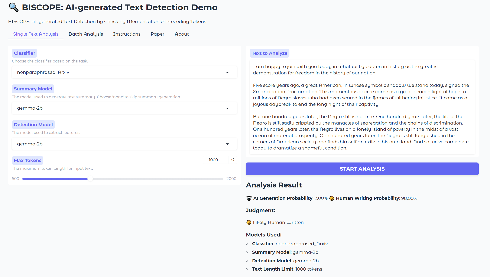

# COMP7404A Computational Intelligence and Machine Learning
## Group Project - Group R
### Demo


### Paper
BISCOPE: AI-generated Text Detection by Checking Memorization of Preceding Tokens
### Members
* Qirui Chen u3665599@connect.hku.hk
* An Wang u3666321@connect.hku.hk
* Mingze Zhao u3665791@connect.hku.hk
### Quick Start
1. Clone the repo.
2. Install the dependencies, `python>=3.11`.
```bash
pip install -r requirements.txt
```
3. Run the demo, if you want the summary model to call API, fillout the `API_KEY` global variable at the beginning of the `main.py` file. 
```bash
python main.py
```
4. Copy the shareable link to your browser. Copy and paste the text you want to detect. 
### File Structure
* `./Classifiers`: Classifiers for detecting text generated by LLMs.
* `inference.py`: Inference module running locally. 
* `train_classifier.py`: Classifier training module. This using the features generated by the original Biscope algorithm. 
* `main.py`: Main file. 
* `biscope.py` and `biscope_utils.py`: Original Biscope algorithm.
### Abstract
Detecting text generated by Large Language Models (LLMs) is a pressing need in order to identify and prevent misuse of these powerful models in a wide range of applications, which have highly undesirable consequences such as misinformation and academic dishonesty. Given a piece of subject text, many existing detection methods work by measuring the difficulty of LLM predicting the next token in the text from their prefix. In this paper, we make a critical observation that how well the current token’s output logits memorizes the closely preceding input tokens also provides strong evidence. Therefore, we propose a novel bi-directional calculation method that measures the cross-entropy losses between an output logits and the ground-truth token (forward) and between the output logits and the immediately preceding input token (backward). A classifier is trained to make the final prediction based on the statistics of these losses. We evaluate our system, named BISCOPE, on texts generated by five latest commercial LLMs across five heterogeneous datasets, including both natural language and code. BISCOPE demonstrates superior detection accuracy and robustness compared to nine existing baseline methods, exceeding the state-of-the-art non-commercial methods’ detection accuracy by over 0.30 F1 score, achieving over 0.95 detection F1 score on average. It also outperforms the best commercial tool GPTZero that is based on a commercial LLM trained with an enormous volume of data. Code is available at https://github.com/MarkGHX/BiScope.

